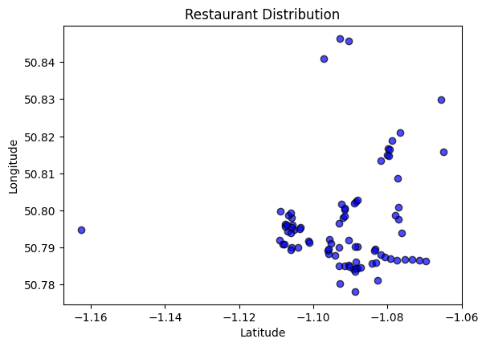
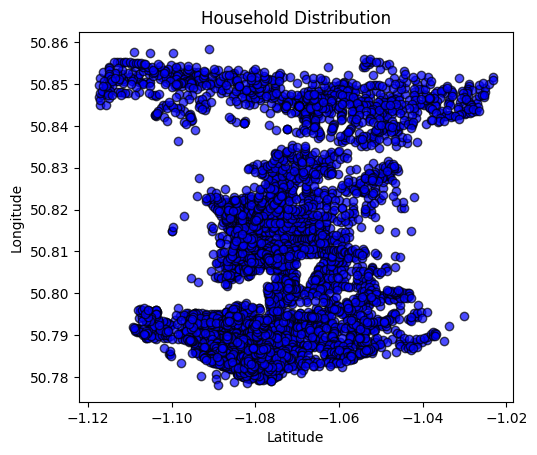
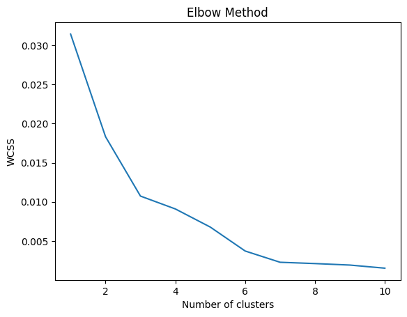
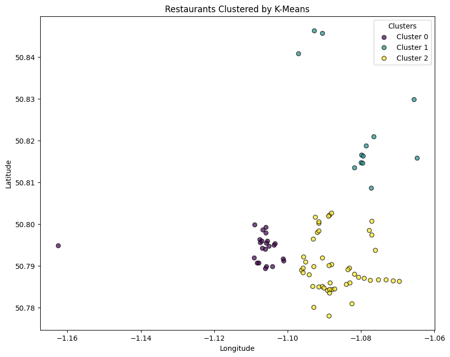
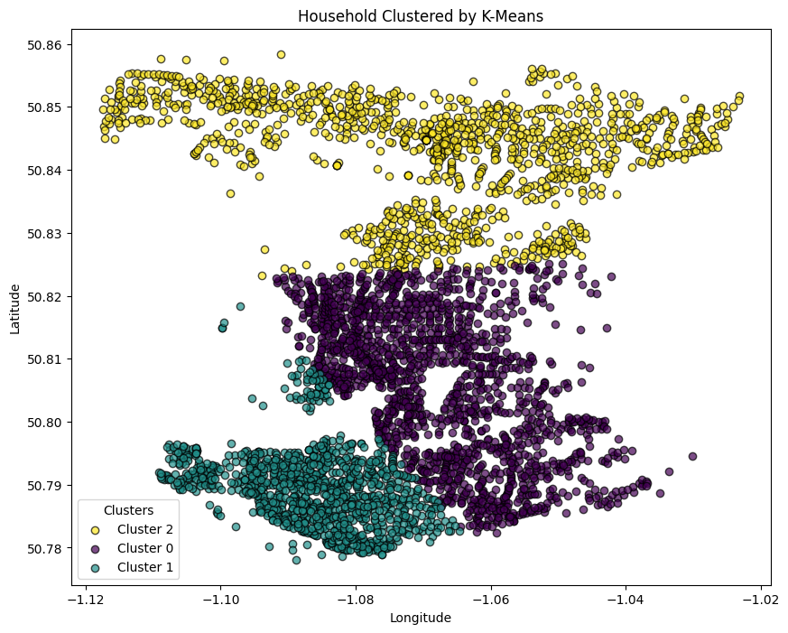
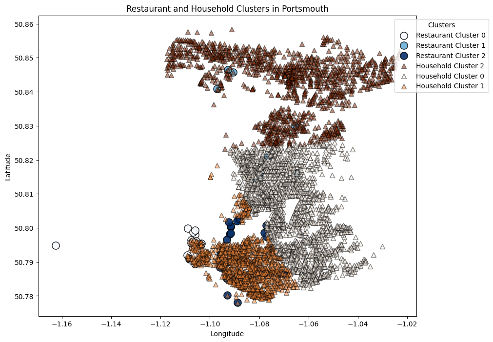

<h1>Spatial Analysis of Portsmouth’s Dining Landscape</h1>

**Objective:**

1. **Identify High-Potential Zones:** Find areas with high-income demographics but low restaurant density for targeted marketing campaigns.
2. **Focus on Under-Served Zones:** Attract new businesses to areas with low restaurant density but high incomes.
3. **Enable Strategic Pricing:** Use a regression model to predict average price ranges based on density, income, and demand.
4. **Facilitate Business Expansion:** Implement a system to recommend optimal locations for new restaurants.


<h2>1. Import Libraries and Load Data</h2>


```python
import pandas as pd
import geopandas as gpd
import matplotlib.pyplot as plt
from sklearn.cluster import KMeans
from sklearn.ensemble import RandomForestClassifier
from sklearn.model_selection import train_test_split
from sklearn.metrics import classification_report
import numpy as np
import warnings

warnings.filterwarnings("ignore", category=UserWarning)
```

<h2>2. Data Collection and Preprocessing</h2>

<h3>2.1 Collection</h3>

**Data Acquisition:**

* **portsmouth_restaurants_google_maps_data.csv:** This data was acquired through web scraping. 
* **portsmouth_restaurants_location.csv:** This file was created by extracting postcodes from `portsmouth_restaurants_google_maps_data.csv` and then geocoding them.
* **portsmouth_2020_housing_info.csv:** This data was extracted from the file `NSP21CL_NOV23_UK_LU.csv`, downloaded from [https://open-geography-portalx-ons.hub.arcgis.com/datasets/ons::postcode-to-oa-2021-to-lsoa-to-msoa-to-lad-with-2011-classifications-november-2023-best-fit-lookup-in-the-uk/about](https://open-geography-portalx-ons.hub.arcgis.com/datasets/ons::postcode-to-oa-2021-to-lsoa-to-msoa-to-lad-with-2011-classifications-november-2023-best-fit-lookup-in-the-uk/about).
* **england_msoa_2021.csv:** This data was downloaded from [https://borders.ukdataservice.ac.uk/easy_download_data.html?data=England_msoa_2021](https://borders.ukdataservice.ac.uk/easy_download_data.html?data=England_msoa_2021).


<h3>2.1 Preprocessing</h3>

<h4>Combine Datasets</h4>


```python
# Load data
restaurants_df = pd.read_csv('./data/portsmouth_restaurants_google_maps_data.csv').merge(
    pd.read_csv('./data/portsmouth_restaurants_location.csv'),
    how='left', on='postcode'
)
household_df = pd.read_csv('./data/portsmouth_2020_housing_info.csv').merge(
    pd.read_csv('./data/england_msoa_2021.csv'),
    how='left', left_on='MSOA code', right_on='msoa21cd'
)

# Save unique MSOA geocodes
household_msoa = household_df.drop_duplicates('MSOA code')[['MSOA code', 'x', 'y']]

# Convert coordinates
def msoa_to_latlon(easting, northing):
    gdf = gpd.GeoDataFrame({'Easting': [easting], 'Northing': [northing]},
                           geometry=gpd.points_from_xy([easting], [northing]))
    gdf.set_crs(epsg=27700, inplace=True)
    gdf = gdf.to_crs(epsg=4326)
    return gdf.geometry.x[0], gdf.geometry.y[0]

household_msoa['latitude'], household_msoa['longitude'] = zip(
    *household_msoa.apply(lambda row: msoa_to_latlon(row['x'], row['y']), axis=1)
)
```

<h3>2.2 Clean Data</h3>


```python
# Handle restaurant data
restaurants_df.drop_duplicates(subset=['postcode'], inplace=True)
restaurants_df.fillna({'priceRanges': restaurants_df['priceRanges'].mode()[0]}, inplace=True)
restaurants_df['priceRangeAvg'] = restaurants_df['priceRanges'].str.extract(r'(\d+)').astype(float)

# Handle household data
household_df = household_df.rename(columns={
    'Total annual income (�)': 'Total annual income',
    'pcd8': 'postcode'
}).drop(columns=['hclnmw', 'msoa21cd_y'])

household_df.drop_duplicates(subset=['postcode'], inplace=True)
household_df.dropna(subset=['postcode'], axis=0, inplace=True)

```

<h3>Enrich Datasets with MSOA</h3>


```python
import requests
import pandas as pd

def fetch_postcode_msoa_batch(postcodes):
    """
    Fetches MSOA codes for a batch of postcodes using the Postcodes.io API.

    Args:
        postcodes (list): A list of postcodes.

    Returns:
        pd.DataFrame: A DataFrame containing postcodes and their corresponding MSOA codes.
    """

    base_url = "https://api.postcodes.io/postcodes"
    data = []

    payload = {"postcodes": postcodes}
    response = requests.post(base_url, json=payload)
    response.raise_for_status()
    api_response = response.json()

    for result in api_response['result']:
        postcode = result['query']
        if result['result'] != None:
            msoa = result['result']['codes']['msoa'] if 'codes' in result.get('result', '') else None
            data.append({'postcode': postcode, 'msoa': msoa})

    return pd.DataFrame(data)

def fetch_postcode_msoa(postcodes, batch_size=99):
    """
    Fetches MSOA codes for a list of postcodes, handling batching for API rate limits.

    Args:
        postcodes (list): A list of postcodes.
        batch_size (int): The maximum number of postcodes to send in each API request.

    Returns:
        pd.DataFrame: A DataFrame containing postcodes and their corresponding MSOA codes.
    """

    all_data = []
    for i in range(0, len(postcodes), batch_size):
        batch = postcodes[i:i+batch_size]
        batch_data = fetch_postcode_msoa_batch(batch)
        all_data.append(batch_data)

    return pd.concat(all_data, ignore_index=True)

# Fetch MSOA codes for each postcode in batches
restaurant_msoa_df = fetch_postcode_msoa(restaurants_df['postcode'].tolist())
restaurants_df = restaurants_df.merge(restaurant_msoa_df, on='postcode', how='left')

# Save the updated restaurant data
restaurants_df.to_csv('./data/restaurants_with_msoa.csv', index=False)
```


```python
def fetch_postcode_coordinates_batch(postcodes):
    """
    Fetches latitude and longitude for a batch of postcodes using the Postcodes.io API.

    Args:
        postcodes (list): A list of postcodes.

    Returns:
        pd.DataFrame: A DataFrame containing postcodes and their corresponding coordinates.
    """
    base_url = "https://api.postcodes.io/postcodes"
    data = []

    payload = {"postcodes": postcodes}
    response = requests.post(base_url, json=payload)
    response.raise_for_status()
    api_response = response.json()

    for result in api_response['result']:
        postcode = result['query']
        if result['result'] is not None:
            latitude = result['result']['latitude']
            longitude = result['result']['longitude']
            data.append({'postcode': postcode, 'latitude': latitude, 'longitude': longitude})

    return pd.DataFrame(data)


def fetch_postcode_coordinates(postcodes, batch_size=99):
    """
    Fetches latitude and longitude for a list of postcodes, handling batching for API rate limits.

    Args:
        postcodes (list): A list of postcodes.
        batch_size (int): The maximum number of postcodes to send in each API request.

    Returns:
        pd.DataFrame: A DataFrame containing postcodes and their corresponding coordinates.
    """
    all_data = []
    for i in range(0, len(postcodes), batch_size):
        batch = postcodes[i:i + batch_size]
        batch_data = fetch_postcode_coordinates_batch(batch)
        all_data.append(batch_data)

    return pd.concat(all_data, ignore_index=True)

# Fetch coordinates for household postcodes
household_coordinates_df = fetch_postcode_coordinates(household_df['postcode'].tolist())
household_df = household_df.merge(household_coordinates_df, on='postcode', how='left')

# household_df['postcode'].tolist()
```

<h2>3. Geospatial Analysis</h2>

<h3>3.1 Visualizing Distribution</h3>

Restaurants


```python
restaurants_df.dropna(subset=['latitude', 'longitude'], inplace=True, how='any')
restaurant_gdf = gpd.GeoDataFrame(restaurants_df, geometry=gpd.points_from_xy(
    restaurants_df['longitude'], restaurants_df['latitude']
))
plt.figure(figsize=(10, 8))
restaurant_gdf.plot(color='blue', alpha=0.7, edgecolor='black')
plt.title("Restaurant Distribution")
plt.xlabel("Latitude")
plt.ylabel("Longitude")
plt.show()
```


    <Figure size 1000x800 with 0 Axes>


    

    


Household


```python
household_df.dropna(subset=['latitude', 'longitude'], inplace=True, how='any')
household_gdf = gpd.GeoDataFrame(household_df, geometry=gpd.points_from_xy(
    household_df['longitude'], household_df['latitude']
))
plt.figure(figsize=(10, 8))
household_gdf.plot(color='blue', alpha=0.7, edgecolor='black')
plt.title("Household Distribution")
plt.xlabel("Latitude")
plt.ylabel("Longitude")
plt.show()
```


    <Figure size 1000x800 with 0 Axes>


    

    


<h3>3.2 Clustering</h3>

K-Means Clustering


```python
# Elbow Method
wcss = []
for i in range(1, 11):
    kmeans = KMeans(n_clusters=i, init='k-means++', random_state=42)
    kmeans.fit(restaurant_gdf[['longitude', 'latitude']])
    wcss.append(kmeans.inertia_)

plt.plot(range(1, 11), wcss)
plt.title('Elbow Method')
plt.xlabel('Number of clusters')
plt.ylabel('WCSS')
plt.show()
```


    

    


```python
restaurant_gdf['restaurant_cluster'] = KMeans(n_clusters=3, random_state=42).fit_predict(
    restaurant_gdf[['longitude', 'latitude']]
)

household_gdf['household_cluster'] = KMeans(n_clusters=3, random_state=42).fit_predict(
    household_gdf[['longitude', 'latitude']]
)
```

Restaurant Cluster


```python
plt.figure(figsize=(10, 8))
        
# Get unique cluster labels
restaurant_clusters = restaurant_gdf['restaurant_cluster'].unique()
        
# Use a colormap to assign a color to each cluster
cmap = plt.get_cmap('viridis', len(restaurant_clusters))
        
# Plot each cluster with its respective color
for cluster in restaurant_clusters:
    cluster_gdf = restaurant_gdf[restaurant_gdf['restaurant_cluster'] == cluster]
    plt.scatter(cluster_gdf.geometry.x, cluster_gdf.geometry.y, 
        label=f'Cluster {cluster}', 
        c=[cmap(cluster / len(restaurant_clusters))],
        alpha=0.7, edgecolor='black')
        
plt.title("Restaurants Clustered by K-Means")
plt.xlabel("Longitude")
plt.ylabel("Latitude")
plt.legend(title="Clusters")
plt.show()
```


    

    


Household Cluster


```python
plt.figure(figsize=(10, 8))
        
# Get unique cluster labels
household_clusters = household_gdf['household_cluster'].unique()
        
# Use a colormap to assign a color to each cluster
cmap = plt.get_cmap('viridis', len(household_clusters))
        
# Plot each cluster with its respective color
for cluster in household_clusters:
    cluster_gdf = household_gdf[household_gdf['household_cluster'] == cluster]
    plt.scatter(cluster_gdf.geometry.x, cluster_gdf.geometry.y, 
        label=f'Cluster {cluster}', 
        c=[cmap(cluster / len(household_clusters))],
        alpha=0.7, edgecolor='black')
        
plt.title("Household Clustered by K-Means")
plt.xlabel("Longitude")
plt.ylabel("Latitude")
plt.legend(title="Clusters")
plt.show()
```


    

    


Combined Cluster


```python
fig, ax = plt.subplots(figsize=(10, 8))

# Plot the base map (replace with your actual base map plotting code)
ax.set_title("Restaurant and Household Clusters in Portsmouth")
ax.set_xlabel("Longitude")
ax.set_ylabel("Latitude")

# Marker styles for restaurants and households
restaurant_style = {'s': 120, 'marker': 'o', 'edgecolor': 'black', 'alpha': 0.9}  # Increased transparency
household_style = {'s': 50, 'marker': '^', 'edgecolor': 'black', 'alpha': 0.5}  # Lower transparency

# Function to plot clusters with unique colors and styles
def plot_clusters(gdf, cluster_column, label_prefix, style, ax, colormap):
    unique_clusters = gdf[cluster_column].unique()
    cmap = plt.get_cmap(colormap, len(unique_clusters))
    
    for i, cluster in enumerate(unique_clusters):
        cluster_gdf = gdf[gdf[cluster_column] == cluster]
        ax.scatter(
            cluster_gdf.geometry.x,
            cluster_gdf.geometry.y,
            label=f'{label_prefix} Cluster {cluster}',
            c=[cmap(cluster / len(unique_clusters))],
            **style  
        )

plot_clusters(restaurant_gdf, 'restaurant_cluster', 'Restaurant', restaurant_style, ax, 'Blues')
plot_clusters(household_gdf, 'household_cluster', 'Household', household_style, ax, 'Oranges')
ax.legend(title="Clusters", loc="upper right", bbox_to_anchor=(1.2, 1))
plt.show()

```


    

    


<h3>3.3 Spatial Features</h3>

Restaurant Density


```python
restaurants_df.rename(columns={'msoa': 'MSOA code'},inplace=True)
restaurant_density = restaurants_df.groupby('MSOA code').size().reset_index(name='restaurant_density')
household_gdf = household_gdf.merge(restaurant_density, on='MSOA code', how='left').fillna(0)

```

Spatial Join for Analysis


```python
spatial_join = gpd.sjoin_nearest(household_gdf, restaurant_gdf, distance_col='distance')
spatial_join = spatial_join[spatial_join['distance'] <= 1000]
spatial_join.rename(columns={'MSOA code_left': 'MSOA code'},inplace=True)
spatial_join['avg_restaurant_rating'] = spatial_join.groupby('MSOA code')['rating'].transform('mean')
spatial_join['total_income'] = spatial_join['Total annual income'].str.replace(",", "").astype(float)

```

<h3>4. Predictive Modeling</h3>

<h4>4.1 Feature Aggregation<h4>


```python
features = spatial_join.groupby('MSOA code').agg({
    'restaurant_density': 'mean',
    'avg_restaurant_rating': 'mean',
    'total_income': 'mean',
    'household_cluster': 'first',
}).reset_index()

```

<h4>4.2 Model Training<h4>


```python
X = features[['restaurant_density', 'avg_restaurant_rating', 'total_income']]
y = features['household_cluster']
X_train, X_test, y_train, y_test = train_test_split(X, y, test_size=0.2, random_state=42)

model = RandomForestClassifier(random_state=42, n_jobs=-1)
model.fit(X_train, y_train)
y_pred = model.predict(X_test)

print("Model Evaluation:")
print(classification_report(y_test, y_pred))
```

    Model Evaluation:
                  precision    recall  f1-score   support
    
               0       0.33      0.50      0.40         2
               1       0.00      0.00      0.00         1
               2       1.00      0.50      0.67         2
    
        accuracy                           0.40         5
       macro avg       0.44      0.33      0.36         5
    weighted avg       0.53      0.40      0.43         5
    
    

<h4>5. Outputs and Insights</h4>


```python
features.to_csv('./data/aggregated_features.csv', index=False)
```

**aggregated_features.csv**

| MSOA Code | Restaurant Density | Avg. Restaurant Rating | Total Income | Household Cluster |
|---|---|---|---|---|
| E02003524 | 0.0 | 4.003896103896104 | 37300.0 | 2 |
| E02003525 | 2.0 | 3.774522292993631 | 37700.0 | 2 |
| E02003526 | 0.0 | 4.0 | 53700.0 | 2 |
| E02003527 | 1.0 | 4.230625 | 47800.0 | 2 |
| E02003529 | 0.0 | 4.0 | 51600.0 | 2 |
| E02003530 | 0.0 | 4.260645161290323 | 44100.0 | 0 |
| E02003531 | 1.0 | 4.320754716981132 | 46800.0 | 0 |
| E02003532 | 2.0 | 4.384799999999999 | 48900.0 | 0 |
| E02003533 | 0.0 | 4.451818181818182 | 43400.0 | 2 |
| E02003534 | 5.0 | 4.578181818181818 | 49300.0 | 0 |
| E02003535 | 0.0 | 4.510852713178294 | 44800.0 | 0 |
| E02003536 | 1.0 | 4.342307692307693 | 31000.0 | 1 |
| E02003537 | 0.0 | 4.735849056603773 | 44800.0 | 0 |
| E02003538 | 2.0 | 4.227218934911242 | 43500.0 | 0 |
| E02003540 | 0.0 | 4.4547169811320755 | 44200.0 | 0 |
| E02003541 | 3.0 | 4.66180904522613 | 32000.0 | 1 |
| E02003542 | 0.0 | 4.422580645161291 | 46100.0 | 0 |
| E02003543 | 7.0 | 4.485714285714286 | 46200.0 | 0 |
| E02003544 | 0.0 | 4.4 | 50900.0 | 0 |
| E02003545 | 13.0 | 4.631868131868132 | 45000.0 | 1 |
| E02003546 | 0.0 | 4.407643312101911 | 51800.0 | 1 |
| E02003547 | 28.0 | 4.4877358490566035 | 46300.0 | 1 |
| E02003548 | 3.0 | 4.6022727272727275 | 52300.0 | 1 |
| E02006821 | 0.0 | 4.0 | 54000.0 | 2 |


<h4>6. Predictive Models</h4>


```python
# Aggregate features for regression
regression_features = spatial_join.groupby('MSOA code').agg({
    'restaurant_density': 'mean',
    'avg_restaurant_rating': 'mean',
    'total_income': 'mean',
    'priceRangeAvg': 'mean',
    'distance': 'mean'
}).reset_index()
```

Regression Model


```python
from sklearn.linear_model import LinearRegression
from sklearn.metrics import mean_squared_error, r2_score

# Prepare data
X_reg = regression_features[['restaurant_density', 'avg_restaurant_rating', 'total_income', 'distance']]
y_reg = regression_features['priceRangeAvg']

# Train-test split
X_train_reg, X_test_reg, y_train_reg, y_test_reg = train_test_split(X_reg, y_reg, test_size=0.2, random_state=42)

# Fit model
reg_model = LinearRegression()
reg_model.fit(X_train_reg, y_train_reg)

# Evaluate
y_pred_reg = reg_model.predict(X_test_reg)
print("Regression Model Performance:")
print(f"Mean Squared Error: {mean_squared_error(y_test_reg, y_pred_reg):.2f}")
print(f"R² Score: {r2_score(y_test_reg, y_pred_reg):.2f}")
```

    Regression Model Performance:
    Mean Squared Error: 12.55
    R² Score: 0.21
    

**Summary and Key Insights**

This dataset delves into Portsmouth's urban landscape by analyzing socioeconomic, geospatial, and business characteristics of Middle Layer Super Output Areas (MSOAs). Key features include income levels, household composition, restaurant density, and average ratings.

**Features Overview**

* **MSOA Code**: Unique identifier for each geographic area.
* **Restaurant Density**: Number of restaurants per MSOA.
* **Average Restaurant Rating**: Aggregated customer review score.
* **Total Income**: Average or total income levels of residents.
* **Household Cluster**: Categorical feature grouping areas by household characteristics.

**Key Insights**

**Restaurant Activity and Distribution**

* Restaurants cluster in city centers and coastal areas.
* Most MSOAs have low restaurant density, but specific areas stand out:
  * **E02003547**: 28 restaurants, average rating 4.48, a dining hotspot.
  * **E02003545**: 13 restaurants, high rating 4.63, moderate income (£45,000), a thriving commercial zone.

**Restaurant Quality and Income Correlation**

* Average restaurant ratings range from 4.0 to 4.7.
* Higher-income areas often have higher-rated restaurants, but this doesn't always correlate with density.
* **E02003536** is an outlier: low income (£31,000), low density (1 restaurant), but a high rating (4.34).

**Household and Spatial Patterns**

* Households are evenly distributed, with clusters in specific areas.
* Cluster analysis identifies 3 optimal clusters:
  * **Cluster 0**: High restaurant density and ratings.
  * **Cluster 1**: Moderate densities and variable incomes.
  * **Cluster 2**: High-income areas with low restaurant density.

**Spatial Relationships and Opportunities**

* Overlapping restaurant and household clusters indicate potential demand.
* High household density and low restaurant density suggests opportunities for new ventures.

**Actionable Insights**

**Restaurant Business Opportunities**

* **Expand in high-income, low-density areas**: Target areas like **E02006821** and **E02003526**.
* **Enhance quality in high-density zones**: Focus on maintaining or improving ratings in hubs like **E02003547**.

**Urban and Economic Planning**

* **Balance residential and commercial development**: Align future development with demand.
* **Support local businesses**: Implement supportive regulations and incentives.

**Targeting Household Clusters**

* **Cluster 2**: Market premium dining experiences.
* **Cluster 1**: Develop affordable, family-oriented options.

**Community Engagement**

* Involve local communities in planning to align with their needs.

By combining socioeconomic, geospatial, and visualized data, this analysis provides actionable insights for business expansion, urban planning, and community engagement to enhance Portsmouth's dining landscape and overall quality of life.

